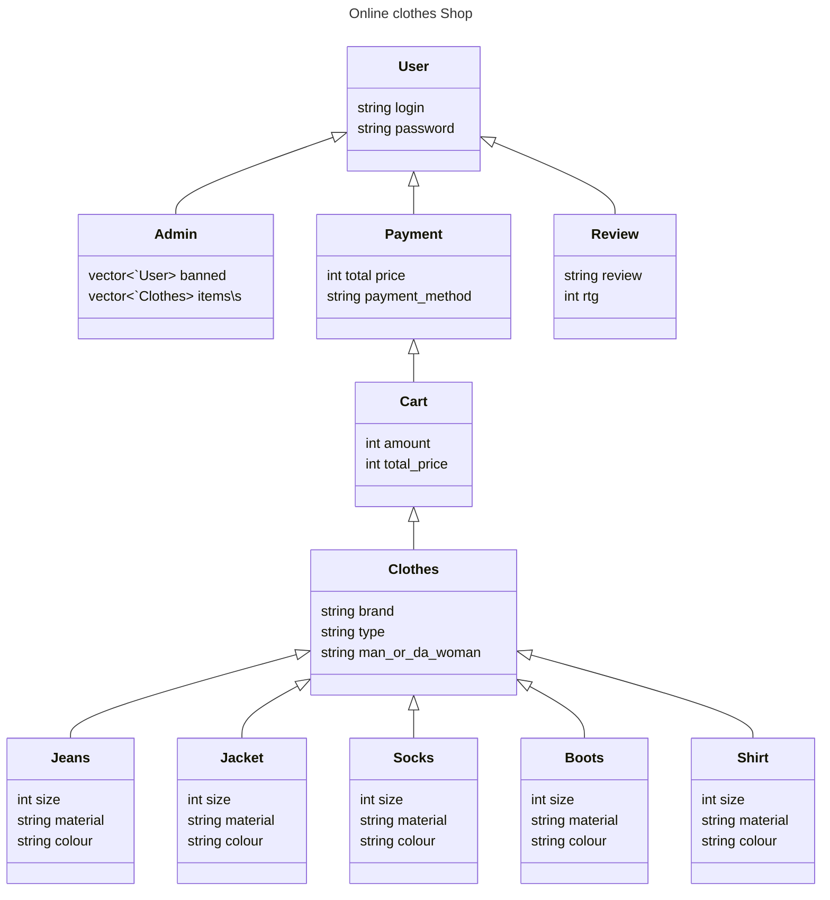

```mermaid
---
title: Online clothes Shop
---
classDiagram
    User<|--Admin
    Payment <|-- Cart
    User <|-- Payment
    User<|--Review
    Cart <|-- Clothes
    Clothes <|-- Jeans
    Clothes <|-- Jacket
    Clothes <|-- Socks
    Clothes <|-- Boots
    Clothes <|-- Shirt


    class User{
        string login
        string password
    }

    class Admin{
        vector<`User> banned
        vector<`Clothes> items\s
    }

    class Clothes{
        string brand
        string type
        string man_or_da_woman
    }

    class Review{
        string review
        int rtg
    }

    class Cart{
        int amount
        int total_price
    }

    class Payment{
        int total price
        string payment_method
    }

    class Jeans{
        int size
        string material
        string colour
    }

    class Jacket{
        int size
        string material
        string colour
    }

    class Socks{
        int size
        string material
        string colour
    }

    class Boots{
        int size
        string material
        string colour
    }

    class Shirt{
        int size
        string material
        string colour
    }
    

```